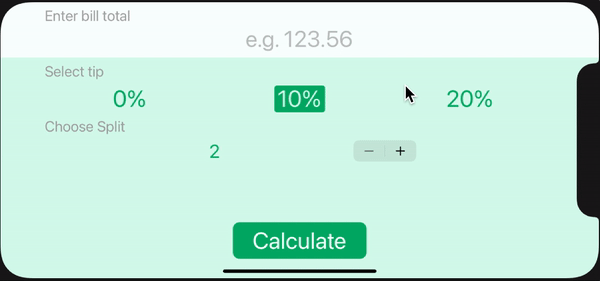
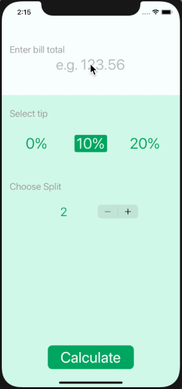

#  BMI Calculator

Bill splitting and tip calculating app

## Goal

The goal of this app is to review some of the concepts learnt in the previous modules. Especially relating to the creation of multi-screen apps through the use of segues.

## Finished App

>Created as a companion project to The App Brewery's Complete App Development Bootcamp.
